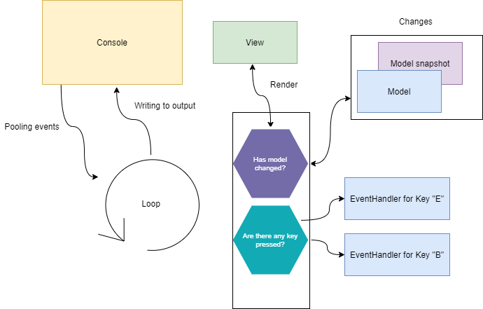

# ConsoleLoop. Loooooop.

Simple console loop with with **model**(view-model) and **view** features.

## Packages Builds
[](https://dev.azure.com/trapov/ConsoleLoop/_build/latest?definitionId=1&branchName=master) 

[](https://www.nuget.org/packages/ConsoleLoooooop/)
## How does it work?


**View** gets called with the **Model** as an argument with each CHANGE in the **Model**. (in other words it is reactive) and returns a string to write it to the stdout.

Declare a model, view and create a looop.
```csharp
var Model = new FileMergeSortModel();
var renderingLoop = new ConsoleLoopBuilder(cancellationToken: CancellationTokenSource.Token)
         .WithInputEventHandler(keyInfo => keyInfo.Key == System.ConsoleKey.UpArrow, _ =>
         {
             Model.Skip -= 10;
          })
		  .WithInputEventHandler(keyInfo => keyInfo.Key == System.ConsoleKey.DownArrow, _ =>
		  {
		    Model.Skip += 10;
		  })
          .Model(Model)
         .ToView<FileMergeSortView>()
         .WithLoop<TaskBasedRenderingLoop<FileMergeSortModel, FileMergeSortView>>();
```

## Example of using

Example using this library in external merge sorting. 
